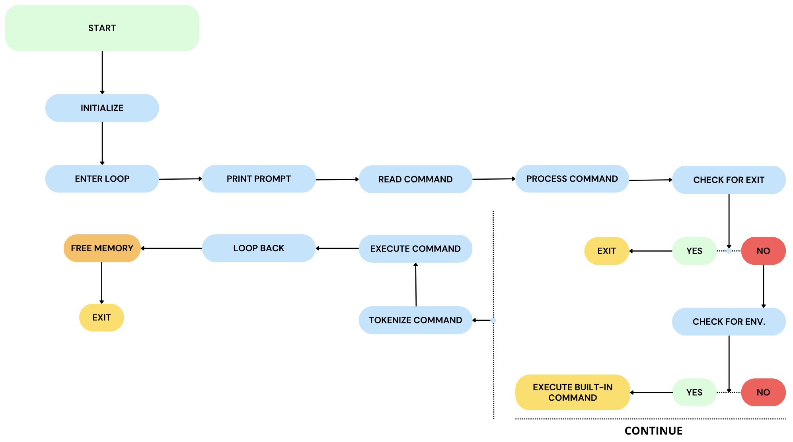

 
<h3>SIMPLE SHELL PROJECT</h3>
<h3>Re-programming SIMPLE SHELL in C</h3>

---

> [!NOTE]
> GitHub repository : holbertonschool-simple_shell

---

 

## :link: - Quick Links -
* [Requirements for this project](#%EF%B8%8F⃣---requirements-for-this-project--)
* [File descriptions](#%EF%B8%8F⃣---file-descriptions--)
* [Team](#%EF%B8%8F⃣---team--)

 

## #️⃣ - Requirements for this project -

- Allowed editors: `vi`, `vim`, `emacs`
- Compile code using flags: `-Wall`, `-Werror`, `-Wextra`, `-pedantic`, `-std=gnu89`
- All your files should end with a new line.
- A README.md file, at the root of the folder of the project.
- Code should be use the [Betty](https://github.com/holbertonschool/Betty) style.
- Cannot use global variables.
- No more than 5 functions per file.
- Function prototypes should be included in header file 'main.h'
- Header files should be include guarded.
- Authorized functions and macros :
	* all functions from `string.h`
	* `access` (`man 2 access`)
	* `chdir` (`man 2 chdir`)
	* `close` (`man 2 close`)
	* `closedir` (`man 3 closedir`)
	* `execve` (`man 2 execve`)
	* `exit` (`man 3 exit`)
	* `_exit` (`man 2 _exit`)
	* `fflush` (`man 3 fflush`)
	* `fork` (`man 2 fork`)
	* `free` (`man 3 free`)
	* `getcwd` (`man 3 getcwd`)
	* `getline` (`man 3 getline`)
	* `getpid` (`man 2 getpid`)
	* `isatty` (`man 3 isatty`)
	* `kill` (`man 2 kill`)
	* `malloc` (`man 3 malloc`)
	* `open` (`man 2 open`)
	* `opendir` (`man 3 opendir`)
	* `perror` (`man 3 perror`)
	* `printf` (`man 3 printf`)
	* `fprintf` (`man 3 fprintf`)
	* `vfprintf` (`man 3 vfprintf`)
	* `sprintf` (`man 3 sprintf`)
	* `putchar` (`man 3 putchar`)
	* `read` (`man 2 read`)
	* `readdir` (`man 3 readdir`)
	* `signal` (`man 2 signal`)
	* `stat` (`__xstat`) (`man 2 stat`)
	* `lstat` (`__lxstat`) (`man 2 lstat`)
	* `fstat` (`__fxstat`) (`man 2 fstat`)
	* `strtok` (`man 3 strtok`)
	* `wait` (`man 2 wait`)
	* `waitpid` (`man 2 waitpid`)
	* `wait3` (`man 2 wait3`)
	* `wait4` (`man 2 wait4`)
	* `write` (`man 2 write`)

> [!CAUTION]
> Compilation command : `gcc -Wall -Werror -Wextra -pedantic -std=gnu89 *.c -o hsh`

 

## #️⃣ - File descriptions -
	
| FILE                                       | DESCRIPTION                       |
|--------------------------------------------|-----------------------------------|
| [`shell.h`](shell.h)                       | Libraries and function prototypes |
| [`shell.c`](shell.c)                       | Mains function of the shell       |
| [`man_1_simple_shell`](man_1_simple_shell) | Man page                          |
| [`README.md`](README.md)                   | README file                       |
| [`AUTHORS`](AUTHORS)                       | File of authors                   |
| [`fork.c`](fork.c)                         | Execute commands                  |
| [`env.c`](env.c)                           | Environment variable              |

 

## #️⃣ - Flowchart -

 

 

## #️⃣ - Team -

*BETI MARANGON Benoît		- [Github](https://github.com/BenBet21)*

*CHLPAC Thomas		- [Github](https://github.com/ThomasC12000)*

---

 

:mortar_board: - STUDENTS AT HOLBERTON SCHOOL TOULOUSE - #C23
